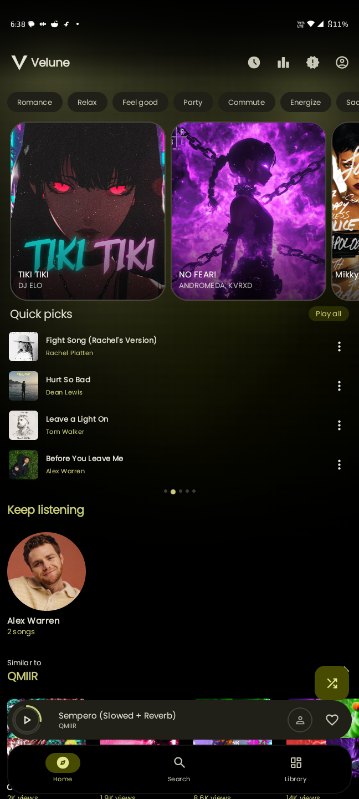
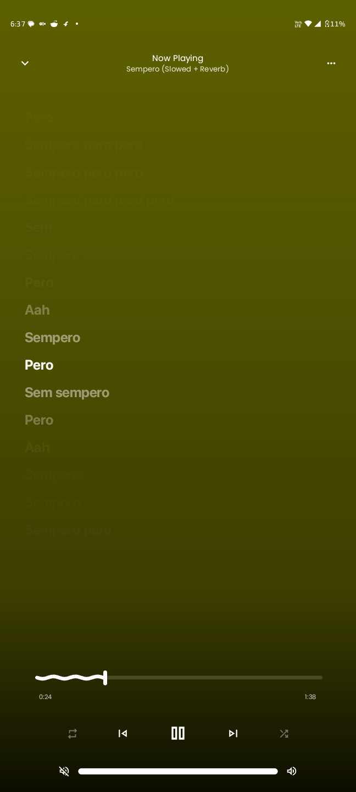
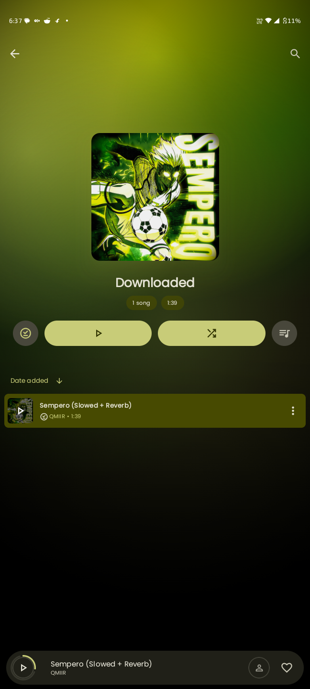
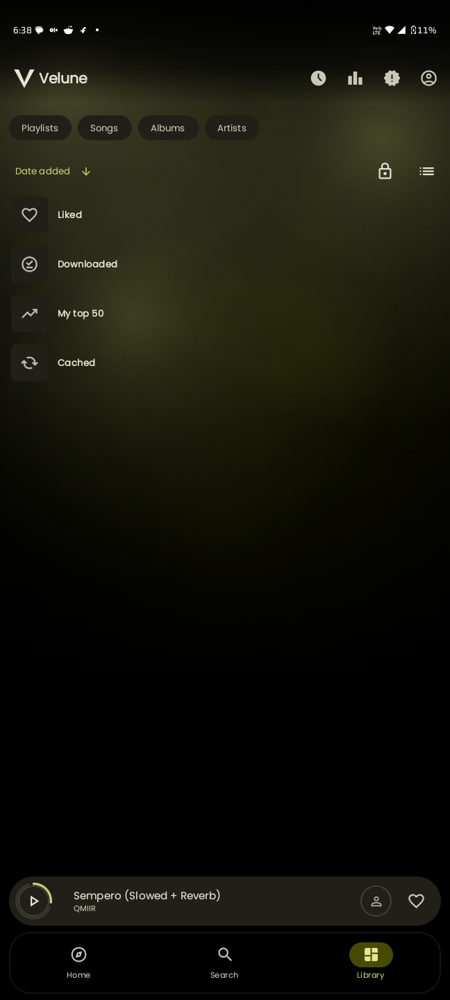
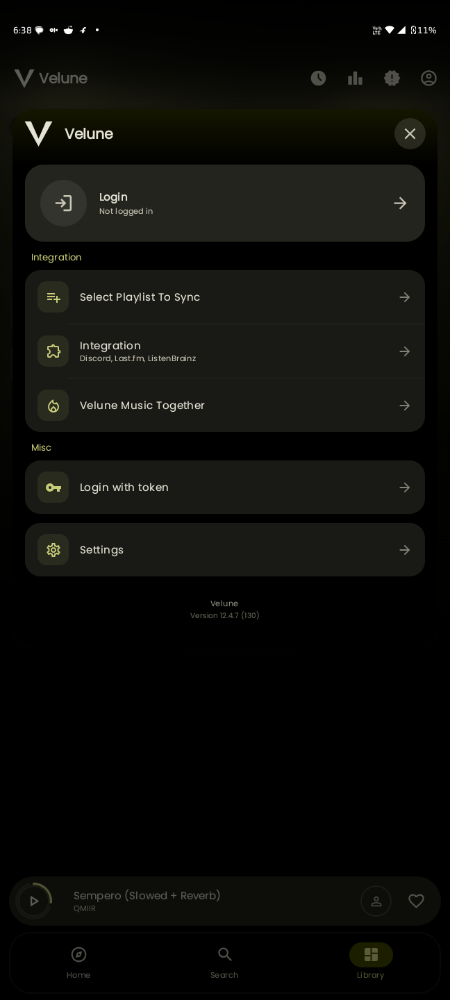
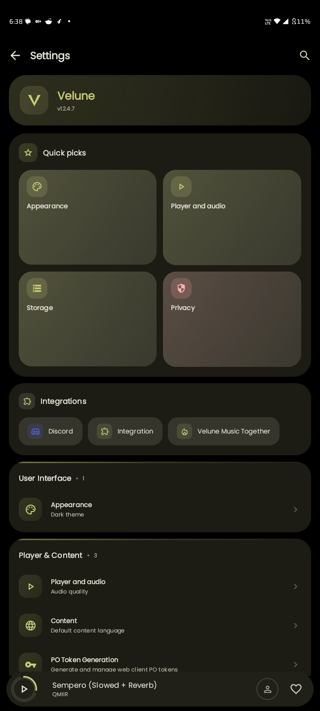
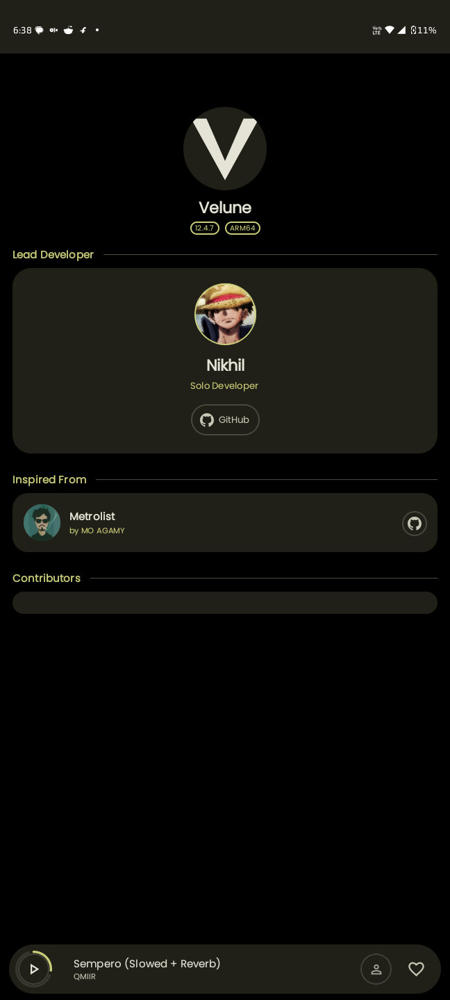

<div align="center">

<br/>

```
 ██╗   ██╗███████╗██╗     ██╗   ██╗███╗   ██╗███████╗
 ██║   ██║██╔════╝██║     ██║   ██║████╗  ██║██╔════╝
 ██║   ██║█████╗  ██║     ██║   ██║██╔██╗ ██║█████╗  
 ╚██╗ ██╔╝██╔══╝  ██║     ██║   ██║██║╚██╗██║██╔══╝  
  ╚████╔╝ ███████╗███████╗╚██████╔╝██║ ╚████║███████╗
   ╚═══╝  ╚══════╝╚══════╝ ╚═════╝ ╚═╝  ╚═══╝╚══════╝
```

**A premium YouTube Music client for Android.**  
*Clean. Offline-capable. Built different.*

<br/>


<br/>

</div>


\---


\## 📸 Screenshots


<div align="center">

<table>

&#x20; <tr>

&#x20;   <td align="center"><br/><sub>Home</sub></td>

&#x20;   <td align="center"><br/><sub>Now Playing</sub></td>

&#x20;   <td align="center"><br/><sub>Lyrics</sub></td>

&#x20;   <td align="center"><br/><sub>Downloaded</sub></td>

&#x20; </tr>

&#x20; <tr>

&#x20;   <td align="center"><br/><sub>Library</sub></td>

&#x20;   <td align="center"><br/><sub>Account</sub></td>

&#x20;   <td align="center"><br/><sub>Settings</sub></td>

&#x20;   <td align="center"><br/><sub>About</sub></td>

&#x20; </tr>

</table>

</div>


\---


\## What is Velune?


Velune is a full-featured Android music app that connects to YouTube Music — no ads, no subscriptions, no compromises. It fetches real data from the YouTube Music InnerTube API, caches it locally, and plays it back with professional-grade audio features.


Built on a modern Kotlin stack with Jetpack Compose and Media3, Velune is designed for people who want the full YouTube Music experience without the YouTube Music app.


\---


\## Features


\### Core

\- \*\*Ad-Free Playback\*\* — zero interruptions, ever

\- \*\*Full Library Sync\*\* — Liked Songs, Playlists, Subscriptions, History

\- \*\*Offline Caching\*\* — smart local storage with encrypted Room database

\- \*\*Background Playback\*\* — battery-optimized MediaSession service


\### Audio

\- \*\*Gapless Playback\*\* — seamless track transitions

\- \*\*Crossfade\*\* — smooth blending between songs

\- \*\*Silence Skipping\*\* — auto-skip quiet gaps

\- \*\*Loudness Normalization\*\* — EBU R128 standard

\- \*\*Tempo \& Pitch Control\*\* — real-time manipulation

\- \*\*System EQ Bridge\*\* — integrates with any equalizer app


\### Visual \& Discovery

\- \*\*Material You (MD3)\*\* — UI adapts to album art color palette

\- \*\*Synced Lyrics\*\* — word-by-word playback with translation support

\- \*\*Discord Rich Presence\*\* — show what you're listening to

\- \*\*Year in Review\*\* — your personal music stats

\- \*\*Home Feed\*\* — personalised Quick Picks, Keep Listening, mood chips

\- \*\*Custom V Loader\*\* — animated Velune branding on every loading state


\---


\## Tech Stack


| Layer | Technology |

|---|---|

| Language | Kotlin |

| UI | Jetpack Compose + Material 3 |

| Architecture | MVVM + Clean Architecture + UDF |

| Audio | Media3 / ExoPlayer |

| Dependency Injection | Hilt |

| Database | Room (encrypted local cache) |

| Networking | Ktor + Retrofit |

| Async | Kotlin Coroutines + Flow API |

| Build | Gradle KTS + Version Catalogs |


\---


\## Project Structure


```

velune/

├── app/              # Main application module
├── innertube/        # YouTube Music InnerTube API client
├── lrclib/           # Synced lyrics fetcher
├── kizzy/            # Discord Rich Presence integration
├── canvas/           # Animated album artwork (BetterLyrics)
├── lastfm/           # Last.fm scrobbling
├── kugou/            # Alternative lyrics provider
└── simpmusic/        # SimpMusic lyrics API

```


\---


\## Getting Started


\### Prerequisites

\- Android Studio Ladybug 2024.2.1 or newer

\- JDK 17

\- Android SDK API 34+


\### Build


```bash

git clone https://github.com/nikhilvishwakarma00/Velune.git

cd Velune

```


Open in Android Studio → let Gradle sync → hit ▶ Run.


\### Generate APK


```

Build → Generate Signed App Bundle / APK → APK → universalRelease

```


\---


\## App Details


| Property | Value |

|---|---|

| Package ID | `com.nikhil.yt` |

| Version | `1.0.0` |

| Min SDK | Android 8.0 (API 26) |

| Target SDK | Android 14 (API 34) |

| Architecture | Universal (arm64, arm32, x86) |


\---


\## Download


Get the latest APK from the \[Releases](https://github.com/nikhilvishwakarma00/Velune/releases/latest) page.


\---


\## Acknowledgements


Velune stands on the shoulders of open-source work:


\- \*\*\[Metrolist](https://github.com/mostafaalagamy/Metrolist)\*\* by MO AGAMY — original inspiration

\- \*\*\[InnerTune](https://github.com/z-huang/InnerTune)\*\* — foundational architecture

\- \*\*\[Kizzy](https://github.com/dead8309/Kizzy)\*\* — Discord RPC integration

\- \*\*\[SimpMusic](https://github.com/maxrave-dev/SimpMusic)\*\* — lyrics API

\- \*\*\[BetterLyrics](https://better-lyrics.boidu.dev/)\*\* — word-by-word lyrics


\---


\## Legal


Velune is an independent third-party client. It is not affiliated with Google LLC or YouTube. Users are encouraged to support artists through official channels.


Licensed under \*\*GPL-3.0\*\* — see \[LICENSE](LICENSE) for details.


\---


<div align="center">


<br/>


\*\*Built with 🎵 by \[Nikhil](https://github.com/nikhilvishwakarma00)\*\*


\*If Velune elevated your music experience, drop a ⭐\*


<br/>


</div>

